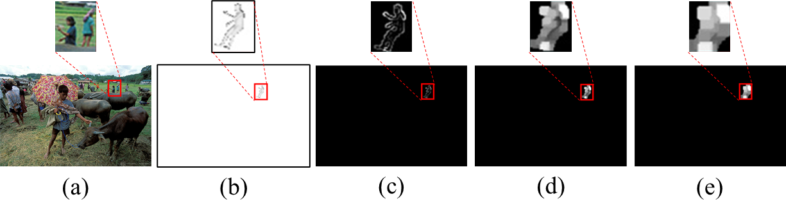
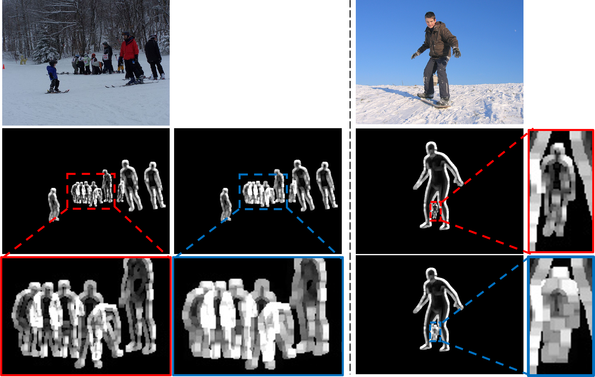
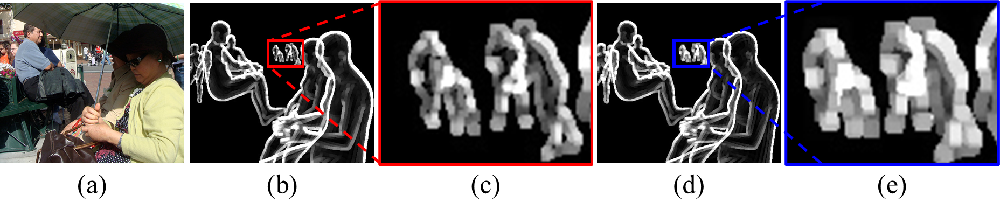

# To create SMPL edge map

## Your data directory
If you set the directory properly in [here](./assets/directory.md), it becomes the directory as below.
(❗Check it out one more time❗)
```  
${ROOT}  
|-- data 
|   |-- J_regressor_extra.npy 
|   |-- CrowdPose
|   |   |-- annotations
|   |   |-- images
|   |-- Human36M  
|   |   |-- images  
|   |   |-- annotations   
|   |   |-- J_regressor_h36m_correct.npy
|   |-- MuCo  
|   |   |-- data  
|   |   |   |-- augmented_set  
|   |   |   |-- unaugmented_set  
|   |   |   |-- MuCo-3DHP.json
|   |   |   |-- smpl_param.json
|   |-- MSCOCO  
|   |   |-- images  
|   |   |   |-- train2017  
|   |   |   |-- val2017 
|   |   |-- annotations  
|   |   |-- J_regressor_coco_hip_smpl.npy
|   |-- MPII  
|   |   |-- annotations
|   |   |-- images
|   |-- 3dpw
|   |   |-- data
|   |   |   |-- 3DPW_latest_train.json
|   |   |   |-- 3DPW_latest_validation.json
|   |   |   |-- 3DPW_latest_test.json
|   |   |   |-- 3DPW_validation_crowd_hhrnet_result.json
|   |   |-- imageFiles
```  
There is no need to create a folder because SMPL edge map production code automatically creates a folder.
* We have designated a location for your directory
* Put your path in `"putting your path"`

## Human3.6M SMPL edge generator
* `"putting your path"` corresponds to line 3, 4, 5, and 39 in `./SMPL_edge_Human36M/make_Human36M_smpl_edge.py`
* 💪 The solution code for "Problem with human 3.6m dataset" mentioned in the supplementary material is a function of h36m_get_smpl_code, which is the 82nd line.
* Human36M is simple to implement because it consists of only one person.
```bash  
python make_Human36M_smpl_edge.py
```    
* It took about 7 days when I implemented it.

## MPII & MSCOCO SMPL edge generator
MPII and MSCOCO have a psuedo gt problem mentioned in the supplementary material.
### MPII
* 💪 The solution code for "Problem with MPII and MSCOCO dataset" mentioned in the supplementary material is a code, which is the 147~156 line.
* `"putting your path"` corresponds to line 3, 4, 5, and 39 in `./SMPL_edge_MPII/make_mpii_smpl_edge.py`
* MPII is a little complicated because it involves a lot of people images.
```bash  
python make_mpii_smpl_edge.py
```    
* It took about 1 days when I implemented it.

### MSCOCO
* 💪 The solution code for "Problem with MPII and MSCOCO dataset" mentioned in the supplementary material is a code, which is the 148~157 line.
* `"putting your path"` corresponds to line 3, 4, 5, and 40 in `./SMPL_edge_MSCOCO/make_MSCOCO_smpl_edge.py`
* MSCOCO is a little complicated because it involves a lot of people images.
```bash  
python make_MSCOCO_smpl_edge.py
```    
* It took about 3 days when I implemented it.

## MuCo SMPL edge generator
* `"putting your path"` corresponds to line 3, 4, 5, and 40 in `./SMPL_edge_MuCo/make_MuCo_smpl_edge.py`
* MuCo is a little complicated because it involves a lot of people images.
```bash  
python make_MuCo_smpl_edge.py
```    
* It took about 14 days when I implemented it.

## AGORA SMPL edge generator (bonus)
* `"putting your path"` corresponds to line 3, 4, 5, 21, and 29 in `./SMPL_edge_AGORA/make_agora_edge_step1.py`  
* `"putting your path"` corresponds to line 40 and 41 in `./SMPL_edge_AGORA/make_agora_edge_step2.py`  
* `"putting your path"` corresponds to line 7 and 8 in `./SMPL_edge_AGORA/make_agora_edge_step3.py`  

```bash  
python make_agora_edge_step1.py  
python make_agora_edge_step2.py  
python make_agora_edge_step3.py  
```    
* It took about 3 days when I implemented it.

## Adaptive dilation Code



* It is applied to 3DPW, Human 3.6M, and MuCo. MSCOCO and MPII are codes applied with 5x5 dilation.
* MSCOCO and MPII were made into 5x5 dilations to show two versions(adaptive_dilation & 5x5 dilation).
* SMPL overlap edge(MSCOCO and MPII ...) on Google drive are all subject to adaptive dilations.
* If you don't have time, refer to 3DPW, Human 3.6M, and MuCo.
